# Visual Diagrams - NotMarket Solana

Complete visual reference for the NotMarket Solana token launchpad system.

---

## Table of Contents

1. [System Architecture](#system-architecture)
2. [PDA Architecture](#pda-architecture)
3. [Token Lifecycle](#token-lifecycle)
4. [Trading Flow](#trading-flow)
5. [Fee Distribution](#fee-distribution)
6. [Bonding Curve](#bonding-curve)
7. [Authorization](#authorization)
8. [Graduation Process](#graduation-process)
9. [Account States](#account-states)
10. [Event Flow](#event-flow)

---

## System Architecture


**Description**: High-level system architecture showing user interactions with program accounts, PDAs, and external systems.

---

## PDA Architecture

### PDA Derivation Map


### PDA Details Table

| PDA Name | Seeds | Bump | Size | Purpose |
|----------|-------|------|------|---------|
| **LaunchpadConfig** | `["launchpad_config"]` | Yes | ~100 bytes | Platform-wide configuration |
| **Mint** | `["mint", creator, name]` | Yes | 82 bytes | SPL Token mint account |
| **TokenLaunch** | `["token_launch", mint]` | Yes | ~200 bytes | Token metadata and state |
| **BondingCurve** | `["bonding_curve", token_launch]` | Yes | ~150 bytes | Pricing and trading state |
| **SOL Vault** | `["sol_vault", bonding_curve]` | Yes | 0 bytes | System account holding SOL |
| **UserPosition** | `["user_position", user, token_launch]` | Yes | ~100 bytes | Individual user holdings |

---

## Token Lifecycle

```mermaid
sequenceDiagram
    participant C as Creator
    participant P as Program
    participant BC as BondingCurve
    participant B as Buyers/Sellers
    participant V as SOL Vault
    participant T as Token Account
    participant D as DEX
    
    Note over C,D: Phase 1: Launch
    C->>P: create_token_launch()
    P->>P: Create Mint (1B tokens)
    P->>BC: Initialize curve state
    P->>T: Send 200M tokens (LP reserve)
    P->>V: Create SOL vault PDA
    
    Note over C,D: Phase 2: Trading (0 to 800M tokens)
    
    loop Trading Phase
        B->>BC: buy_tokens(amount)
        BC->>BC: Calculate price via curve
        BC->>V: Store SOL (99%)
        BC->>P: Send fee to recipient (1%)
        BC->>B: Transfer tokens
        BC->>BC: Update state
        
        B->>BC: sell_tokens(amount)
        BC->>BC: Calculate return price
        BC->>B: Send SOL from vault (99%)
        BC->>P: Send fee to recipient (1%)
        BC->>BC: Update state
        
        BC->>BC: Check graduation
        alt Not Graduated
            BC->>BC: Continue trading
        end
    end
    
    Note over C,D: Phase 3: Graduation (800M sold + $12k)
    
    BC->>BC: Set is_graduated = true 🎓
    BC->>BC: Stop new trades
    
    Note over C,D: Phase 4: LP Creation
    
    C->>P: withdraw_liquidity()
    P->>P: Verify creator + graduated
    V->>C: Transfer ~$12k SOL
    T->>C: Transfer 200M tokens
    
    C->>D: create_pool(SOL, tokens)
    D->>D: Create liquidity pool
    D->>C: Mint LP tokens
    
    Note over C,D: Phase 5: DEX Trading ✅
```



**Key Phases**:
1. **Launch**: Creator initializes token (1B supply, 800M tradeable, 200M for LP)
2. **Trading**: Users buy/sell via bonding curve, price increases
3. **Graduation**: At 800M tokens sold + $12k raised
4. **LP Creation**: Creator withdraws assets and creates DEX pool
5. **DEX Trading**: Token now trades on Raydium/Orca

---

## Trading Flow

### Buy Transaction Flow

```mermaid
graph TB
    Start([User Initiates Buy])
    
    Start --> Input[Input: Token Amount & Max SOL Cost]
    Input --> Check1{Is Launch Active?}
    Check1 -->|No| Error1[❌ Launch Inactive]
    Check1 -->|Yes| Check2{Graduated?}
    Check2 -->|Yes| Error2[❌ Already Graduated]
    Check2 -->|No| Calc[Calculate Cost via Curve]
    
    Calc --> Check3{Cost <= Max?}
    Check3 -->|No| Error3[❌ Slippage Exceeded]
    Check3 -->|Yes| Split[Split Payment]
    
    Split --> Cost[Token Cost: 99%]
    Split --> Fee[Platform Fee: 1%]
    
    Cost --> Vault[Transfer to SOL Vault PDA]
    Fee --> FeeRec[Transfer to Fee Recipient]
    
    Vault --> Transfer[Transfer Tokens to Buyer]
    Transfer --> Update1[Update Bonding Curve State]
    Update1 --> Update2[Update User Position]
    Update2 --> Event[Emit TokensPurchased Event]
    Event --> CheckGrad{Should Graduate?}
    
    CheckGrad -->|Yes| Grad[Set is_graduated = true]
    CheckGrad -->|No| End1([Transaction Complete])
    Grad --> GradEvent[Emit CurveGraduated Event]
    GradEvent --> End2([Transaction Complete])
    
    style Start fill:#e3f2fd
    style End1 fill:#e8f5e9
    style End2 fill:#fff9c4
    style Error1 fill:#ffebee
    style Error2 fill:#ffebee
    style Error3 fill:#ffebee
    style Vault fill:#f3e5f5
    style FeeRec fill:#ffcdd2
```



### Sell Transaction Flow


---

## Fee Distribution


### Fee Breakdown

| Transaction | User Input | Token Cost | Platform Fee | Fee Recipient Gets | Vault Stores |
|-------------|-----------|------------|--------------|-------------------|--------------|
| **Buy 1000 tokens** | 100 SOL | 99 SOL | 1 SOL | ✅ 1 SOL | ✅ 99 SOL |
| **Sell 1000 tokens** | 1000 tokens | 99 SOL | 1 SOL | ✅ 1 SOL | ❌ 99 SOL withdrawn |

---

## Bonding Curve

### Price Progression


### Curve Formula

```mermaid
graph TB
    Input[Input: tokens_to_buy]
    
    Input --> Current[Get current_supply]
    Current --> New[new_supply = current + tokens_to_buy]
    
    New --> Integral[Calculate integral]
    
    Integral --> Formula["∫ price(x) dx from current to new"]
    
    Formula --> Exp["price(x) = START_PRICE * exp(k * x)"]
    
    Exp --> Params["START_PRICE = 0.000000028 SOL<br/>k = growth rate<br/>x = tokens sold"]
    
    Params --> Result[Total Cost in SOL]
    
    Result --> Fee["Add platform fee (1%)"]
    Fee --> Final[Final Cost to User]
    
    style Input fill:#e3f2fd
    style Formula fill:#fff9c4
    style Exp fill:#ffe0b2
    style Final fill:#e8f5e9
```



**Formula Details**:
```
price(supply) = START_PRICE * exp(GROWTH_RATE * supply / CURVE_SUPPLY)

Where:
- START_PRICE = 0.000000028 SOL ($0.000004 USD @ $150/SOL)
- CURVE_SUPPLY = 800,000,000 tokens
- GROWTH_RATE = ln(TARGET_PRICE / START_PRICE) ≈ 13.24
- TARGET_PRICE ≈ 0.015 SOL (at 800M tokens)

Cost = ∫[current_supply to new_supply] price(x) dx
```

---

## Authorization

### Permission Matrix

```mermaid
graph TB
    subgraph "Operations"
        O1[initialize_launchpad]
        O2[create_token_launch]
        O3[buy_tokens]
        O4[sell_tokens]
        O5[toggle_token_launch_active]
        O6[update_metadata_uri]
        O7[withdraw_liquidity]
        O8[get_buy_quote]
    end
    
    subgraph "Authority Checks"
        A1{Is Platform Authority?}
        A2{Any User}
        A3{Any User}
        A4{Any User}
        A5{Is Token Creator?}
        A6{Is Token Creator?}
        A7{Is Token Creator?<br/>+ Graduated?}
        A8{Any User}
    end
    
    subgraph "Results"
        OK[✅ Allowed]
        ERR[❌ Unauthorized]
        ERR2[❌ Not Graduated]
    end
    
    O1 --> A1
    O2 --> A2
    O3 --> A3
    O4 --> A4
    O5 --> A5
    O6 --> A6
    O7 --> A7
    O8 --> A8
    
    A1 -->|Yes| OK
    A1 -->|No| ERR
    
    A2 --> OK
    A3 --> OK
    A4 --> OK
    A8 --> OK
    
    A5 -->|Yes| OK
    A5 -->|No| ERR
    
    A6 -->|Yes| OK
    A6 -->|No| ERR
    
    A7 -->|Yes + Yes| OK
    A7 -->|No| ERR
    A7 -->|Not Graduated| ERR2
    
    style O1 fill:#ffebee
    style O2 fill:#e8f5e9
    style O3 fill:#e8f5e9
    style O4 fill:#e8f5e9
    style O5 fill:#ffebee
    style O6 fill:#ffebee
    style O7 fill:#ffebee
    style O8 fill:#e8f5e9
    style OK fill:#e8f5e9
    style ERR fill:#ffcdd2
    style ERR2 fill:#ffcdd2
```



### Security Mechanisms


---

## Graduation Process


### Graduation Checklist

```mermaid
graph TB
    Start([Start Trading])
    
    Start --> Trade[Execute Trade]
    Trade --> Check1{Tokens Sold<br/>>= 800M?}
    
    Check1 -->|No| Trade
    Check1 -->|Yes| Check2{SOL Raised<br/>>= $12k?}
    
    Check2 -->|No| Trade
    Check2 -->|Yes| Graduate[Set is_graduated = true]
    
    Graduate --> Event[Emit CurveGraduated Event]
    Event --> Block[Block New Trades]
    
    Block --> Wait[Wait for Creator]
    Wait --> Withdraw{Creator Calls<br/>withdraw_liquidity()}
    
    Withdraw -->|No| Wait
    Withdraw -->|Yes| Auth{Verify Creator}
    
    Auth -->|Invalid| Error[❌ Unauthorized]
    Auth -->|Valid| Transfer1[Transfer SOL]
    
    Transfer1 --> Transfer2[Transfer Tokens]
    Transfer2 --> LP[Create DEX Pool]
    LP --> Complete([✅ Complete])
    
    style Start fill:#e3f2fd
    style Graduate fill:#fff9c4
    style Block fill:#ffccbc
    style LP fill:#c8e6c9
    style Complete fill:#a5d6a7
    style Error fill:#ffcdd2
```

---

## Account States


---

## Event Flow


### Event Types


---

## Data Flow Summary


---

## Integration Patterns

### Frontend Integration


---

## Performance Metrics


---

**For more detailed documentation, see:**
- [README.md](./README.md) - Complete project overview
- [ARCHITECTURE.md](./ARCHITECTURE.md) - System architecture
- [EVENT_DOCUMENTATION.md](./EVENT_DOCUMENTATION.md) - Event details
