# NotMarket Solana - Token Launchpad with Bonding Curve

A decentralized token launchpad on Solana featuring automated bonding curve pricing, permissionless trading, and automatic graduation to DEX liquidity pools.

[](./tests)
[](https://www.anchor-lang.com/)
[](https://solana.com/)

---

## 🎯 Overview

NotMarket Solana enables anyone to launch tokens with:
- **Automated Pricing**: Bonding curve determines token price based on supply
- **Fair Launch**: No presale, everyone buys at market price
- **Auto-Graduation**: Successful tokens automatically graduate to DEX with liquidity
- **Low Fees**: Only 1% platform fee on trades

### Key Features

- ✅ Permissionless token creation
- ✅ Bonding curve pricing (exponential growth)
- ✅ Built-in trading (buy/sell)
- ✅ Graduation to DEX at 800M tokens sold
- ✅ Automated LP creation
- ✅ Event-driven architecture
- ✅ Comprehensive test coverage (31/31 passing)

---

## 📊 System Architecture


---

## 🏗️ PDA Architecture

### PDA Derivation Map


### PDA Details

| PDA | Seeds | Purpose | Holds |
|-----|-------|---------|-------|
| **LaunchpadConfig** | `["launchpad_config"]` | Platform configuration | Fee settings, authority |
| **Mint** | `["mint", creator, token_name]` | Token mint account | Token mint authority |
| **TokenLaunch** | `["token_launch", mint]` | Token metadata | Name, symbol, creator info |
| **BondingCurve** | `["bonding_curve", token_launch]` | Pricing state | Tokens sold, SOL reserve |
| **SOL Vault** | `["sol_vault", bonding_curve]` | SOL storage | Trading proceeds for LP |
| **UserPosition** | `["user_position", user, token_launch]` | User holdings | Tokens owned, SOL invested |

---

## 🔄 Token Lifecycle Flow

```mermaid
sequenceDiagram
    participant Creator
    participant Program
    participant BondingCurve
    participant Buyers
    participant DEX
    
    Creator->>Program: 1. Create Token Launch
    Program->>Program: Initialize Mint (1B tokens)
    Program->>BondingCurve: Create curve (800M tradeable)
    Program->>Program: Send 200M tokens to curve for LP
    
    Note over BondingCurve: Phase 1: Trading
    
    Buyers->>BondingCurve: 2. Buy Tokens
    BondingCurve->>BondingCurve: Calculate price (bonding curve)
    BondingCurve->>Buyers: Send tokens
    BondingCurve->>Program: Store SOL in vault
    
    Buyers->>BondingCurve: 3. Sell Tokens (optional)
    BondingCurve->>BondingCurve: Calculate return price
    BondingCurve->>Buyers: Send SOL from vault
    BondingCurve->>Program: Burn/hold tokens
    
    Note over BondingCurve: Check: 800M sold + $12k raised?
    
    BondingCurve->>BondingCurve: 4. Graduate! 🎓
    
    Note over BondingCurve: Phase 2: Graduated
    
    Creator->>Program: 5. Withdraw Liquidity
    Program->>Program: Transfer SOL from vault
    Program->>Program: Transfer 200M tokens
    Creator->>DEX: 6. Create DEX Pool
    DEX->>DEX: LP Created ✅
```



---

## 💰 Fee Distribution Flow


### Fee Breakdown

| Action | User Pays | Token Cost | Platform Fee | Destination |
|--------|-----------|------------|--------------|-------------|
| **Buy** | 100% | 99% → SOL Vault | 1% → Fee Recipient | Vault holds for LP |
| **Sell** | Returns tokens | 99% → User | 1% → Fee Recipient | User gets SOL back |

---

## 📈 Bonding Curve Mechanics


### Curve Parameters

```rust
TOTAL_SUPPLY = 1,000,000,000 tokens (1 billion)
CURVE_SUPPLY = 800,000,000 tokens (tradeable)
LP_SUPPLY = 200,000,000 tokens (reserved for LP)

START_PRICE_USD = 0.000004 USD
GRADUATION_USD = 12,000 USD (target raise)

Price = START_PRICE * exp(growth_rate * tokens_sold)
```

---

## 🔐 Authorization Model


---

## 🚀 Graduation & LP Creation

```mermaid
sequenceDiagram
    participant BC as BondingCurve
    participant Check as Graduation Check
    participant Creator
    participant Vault as SOL Vault PDA
    participant Tokens as Curve Token Account
    participant DEX as DEX Pool
    
    Note over BC: Trading Phase
    BC->>Check: Tokens Sold >= 800M?
    BC->>Check: SOL Raised >= $12k?
    
    alt Both Conditions Met
        Check->>BC: Set is_graduated = true ✅
        BC->>BC: Stop trading
        
        Note over BC: Graduation Complete 🎓
        
        Creator->>BC: Call withdraw_liquidity()
        BC->>BC: Verify creator authority
        BC->>BC: Verify is_graduated = true
        
        BC->>Vault: Transfer all SOL
        Vault->>Creator: ~$12,000 in SOL
        
        BC->>Tokens: Transfer 200M tokens
        Tokens->>Creator: 200M tokens for LP
        
        Creator->>DEX: Create Pool (SOL + Tokens)
        DEX->>DEX: Mint LP tokens
        DEX->>Creator: LP tokens + trading fees
        
        Note over DEX: Token Now Trading on DEX 🎉
    else Conditions Not Met
        Check->>BC: Keep trading
        BC->>BC: is_graduated = false
    end
```



### Graduation Criteria

| Metric | Requirement | Current | Status |
|--------|-------------|---------|--------|
| **Tokens Sold** | 800,000,000 (800M) | Tracked in BondingCurve | ⏳ |
| **SOL Raised** | ~$12,000 USD equivalent | ~80 SOL @ $150/SOL | ⏳ |
| **Is Graduated** | Must be `true` | Automatically set | ⏳ |

---

## 📦 Account State Diagram


---

## 🔧 Installation & Setup

### Prerequisites

```bash
# Install Rust
curl --proto '=https' --tlsv1.2 -sSf https://sh.rustup.rs | sh

# Install Solana CLI
sh -c "$(curl -sSfL https://release.solana.com/stable/install)"

# Install Anchor
cargo install --git https://github.com/coral-xyz/anchor avm --locked --force
avm install 0.30.1
avm use 0.30.1

# Install Node.js dependencies
yarn install
```

### Build

```bash
anchor build
```

### Test

```bash
# Run all tests (31 tests)
anchor test

# Run specific test file
anchor test --skip-build tests/notmarket-solana.ts
```

### Deploy

```bash
# Devnet
anchor deploy --provider.cluster devnet

# Mainnet (use with caution)
anchor deploy --provider.cluster mainnet
```

---

## 📝 Usage Examples

### 1. Initialize Launchpad

```typescript
await program.methods
  .initializeLaunchpad(100) // 1% fee (100 bps)
  .accounts({
    config: configPda,
    authority: authority.publicKey,
    feeRecipient: feeRecipient.publicKey,
    systemProgram: SystemProgram.programId,
  })
  .rpc();
```

### 2. Create Token Launch

```typescript
await program.methods
  .createTokenLaunch(
    "My Token",
    "MTK",
    "https://example.com/metadata.json",
    new BN(150_00000000) // $150 SOL price
  )
  .accounts({
    tokenLaunch: tokenLaunchPda,
    mint: mintPda,
    bondingCurve: bondingCurvePda,
    curveTokenAccount,
    solVault: solVaultPda,
    creator: creator.publicKey,
    tokenProgram: TOKEN_PROGRAM_ID,
    associatedTokenProgram: ASSOCIATED_TOKEN_PROGRAM_ID,
    systemProgram: SystemProgram.programId,
  })
  .signers([creator])
  .rpc();
```

### 3. Buy Tokens

```typescript
await program.methods
  .buyTokens(
    new BN(1_000_000_000), // 1 token (9 decimals)
    new BN(LAMPORTS_PER_SOL) // Max 1 SOL
  )
  .accounts({
    config: configPda,
    tokenLaunch: tokenLaunchPda,
    bondingCurve: bondingCurvePda,
    curveTokenAccount,
    solVault: solVaultPda,
    userPosition: userPositionPda,
    mint: mintPda,
    buyerTokenAccount,
    buyer: buyer.publicKey,
    feeRecipient: feeRecipient.publicKey,
    tokenProgram: TOKEN_PROGRAM_ID,
    associatedTokenProgram: ASSOCIATED_TOKEN_PROGRAM_ID,
    systemProgram: SystemProgram.programId,
  })
  .signers([buyer])
  .rpc();
```

### 4. Sell Tokens

```typescript
await program.methods
  .sellTokens(
    new BN(500_000_000), // 0.5 tokens
    new BN(0) // Min 0 SOL (no slippage protection)
  )
  .accounts({
    config: configPda,
    tokenLaunch: tokenLaunchPda,
    bondingCurve: bondingCurvePda,
    curveTokenAccount,
    solVault: solVaultPda,
    userPosition: userPositionPda,
    sellerTokenAccount,
    seller: seller.publicKey,
    feeRecipient: feeRecipient.publicKey,
    tokenProgram: TOKEN_PROGRAM_ID,
    systemProgram: SystemProgram.programId,
  })
  .signers([seller])
  .rpc();
```

### 5. Withdraw Liquidity (After Graduation)

```typescript
await program.methods
  .withdrawLiquidity()
  .accounts({
    tokenLaunch: tokenLaunchPda,
    bondingCurve: bondingCurvePda,
    solVault: solVaultPda,
    curveTokenAccount,
    solRecipient: dexPoolAddress,
    tokenRecipient: dexTokenAccount,
    authority: creator.publicKey,
    tokenProgram: TOKEN_PROGRAM_ID,
    systemProgram: SystemProgram.programId,
  })
  .signers([creator])
  .rpc();
```

---

## 📊 Events

The program emits comprehensive events for easy integration:


### Event Definitions

| Event | Emitted When | Contains |
|-------|--------------|----------|
| **LaunchpadInitialized** | Platform setup | Authority, fee recipient, fee bps |
| **TokenLaunchCreated** | New token launched | Token details, creator, mint |
| **TokensPurchased** | User buys tokens | Amount, cost, fee, buyer |
| **TokensSold** | User sells tokens | Amount, proceeds, fee, seller |
| **UserPositionUpdated** | Trade complete | Holdings, invested, received |
| **CurveGraduated** | Graduation achieved | Final stats, timestamp |
| **LaunchStatusToggled** | Active status changed | New status |
| **MetadataUpdated** | URI updated | New URI |
| **PriceQuoteRequested** | Quote calculated | Amount, cost, fee |

---

## 🧪 Test Coverage

```
✅ 31/31 tests passing (100%)

Test Suites:
├── Initialization (1 test)
├── Token Creation (2 tests)
├── Buying Tokens (4 tests)
├── Selling Tokens (3 tests)
├── Token Launch Management (3 tests)
├── Authorization Tests (10 tests)
│   ├── Restricted operations
│   ├── Authority verification
│   └── Permissionless operations
├── Get Buy Quote (1 test)
├── Graduation Logic (1 test)
├── Account State Verification (1 test)
└── Fee Distribution & Liquidity (5 tests)
    ├── Fee recipient verification
    ├── SOL vault verification
    ├── Token account verification
    ├── Withdrawal authorization
    └── Complete flow summary
```

---

## 📚 Documentation

- [`ARCHITECTURE.md`](./ARCHITECTURE.md) - System architecture and design
- [`FIXED_TOKENOMICS.md`](./FIXED_TOKENOMICS.md) - Tokenomics and bonding curve
- [`EVENT_DOCUMENTATION.md`](./EVENT_DOCUMENTATION.md) - Event system details
- [`FEE_AND_LIQUIDITY_VERIFIED.md`](./FEE_AND_LIQUIDITY_VERIFIED.md) - Fee distribution
- [`AUTHORIZATION_TESTING.md`](./AUTHORIZATION_TESTING.md) - Security model
- [`DIAGRAMS.md`](./DIAGRAMS.md) - Visual diagrams (this file)

---

## 🔒 Security

### Audited Components
- ✅ Authorization controls (has_one constraints)
- ✅ PDA derivation and ownership
- ✅ Fee distribution mechanism
- ✅ Bonding curve calculations
- ✅ Slippage protection
- ✅ Graduation conditions

### Security Best Practices
- PDA-based architecture prevents address spoofing
- Signer verification on all mutations
- Explicit authorization checks (has_one constraints)
- Rent-exemption for all accounts
- Safe math operations (checked arithmetic)
- Comprehensive test coverage

### Known Limitations
- Bonding curve formula is exponential (price increases rapidly)
- No pause mechanism after graduation
- LP creation is manual (not automatic)
- Single authority model for launchpad config

---

## 🤝 Contributing

Contributions are welcome! Please follow these guidelines:

1. Fork the repository
2. Create a feature branch (`git checkout -b feature/amazing-feature`)
3. Commit your changes (`git commit -m 'feat: Add amazing feature'`)
4. Push to the branch (`git push origin feature/amazing-feature`)
5. Open a Pull Request

### Development Workflow

```bash
# 1. Make changes
# 2. Run tests
anchor test

# 3. Check for errors
anchor build

# 4. Commit with conventional commits
git commit -m "feat: Your feature description"

# 5. Push and create PR
git push origin your-branch
```

---

## 📄 License

This project is licensed under the MIT License - see the [LICENSE](LICENSE) file for details.

---

## 🙏 Acknowledgments

- Built with [Anchor Framework](https://www.anchor-lang.com/)
- Powered by [Solana](https://solana.com/)

---

## 📞 Contact & Support

- **Issues**: [GitHub Issues](https://github.com/notdotmarket/notmarket-solana/issues)
- **Discussions**: [GitHub Discussions](https://github.com/notdotmarket/notmarket-solana/discussions)

---

<div align="center">

**Built with ❤️ on Solana**

[Website](https://notmarket.io) • [Twitter](https://twitter.com/notmarket) • [Discord](https://discord.gg/notmarket)

</div>
